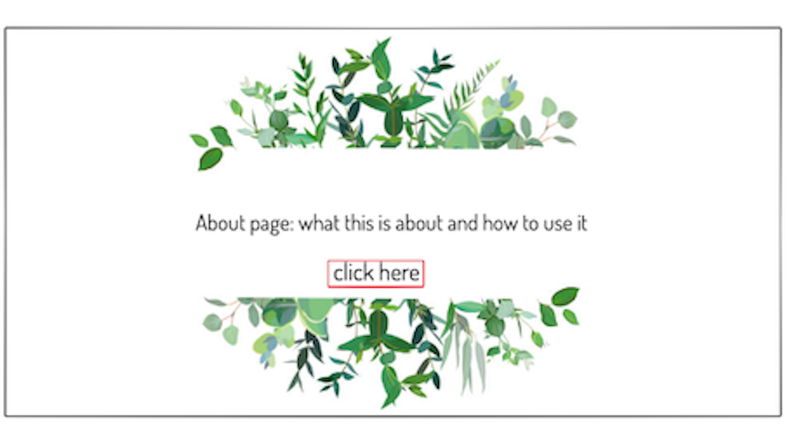
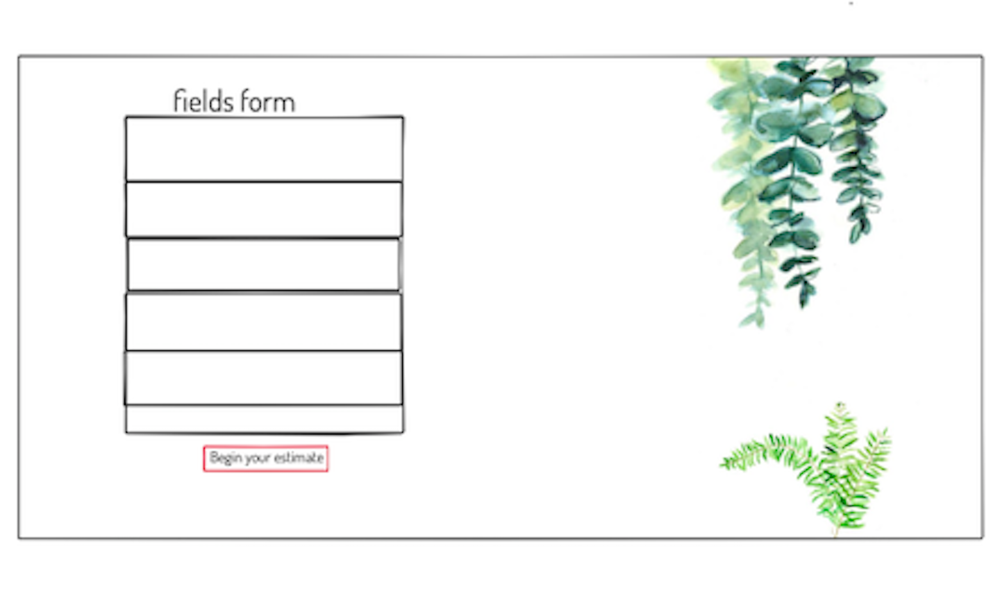
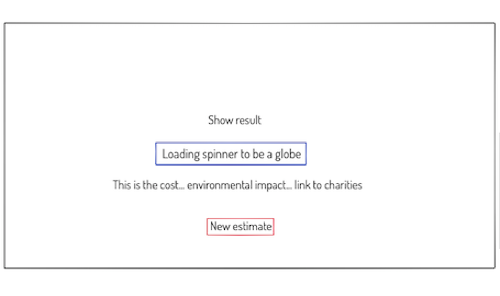
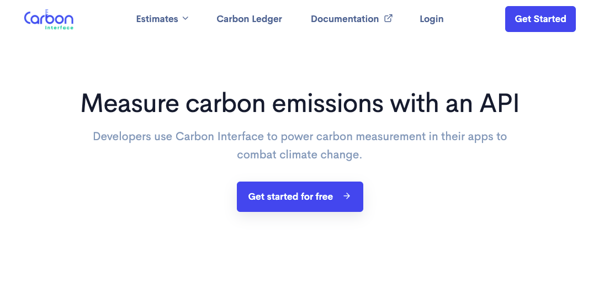
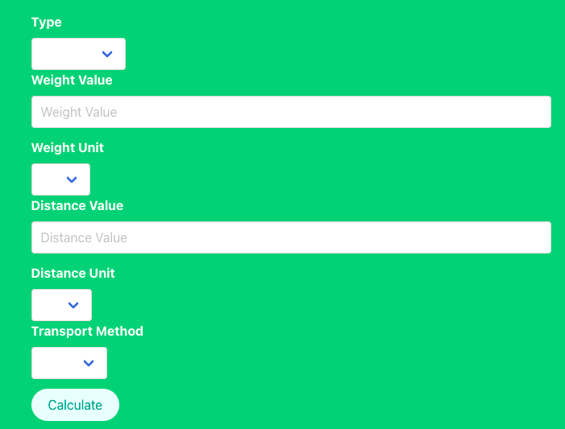
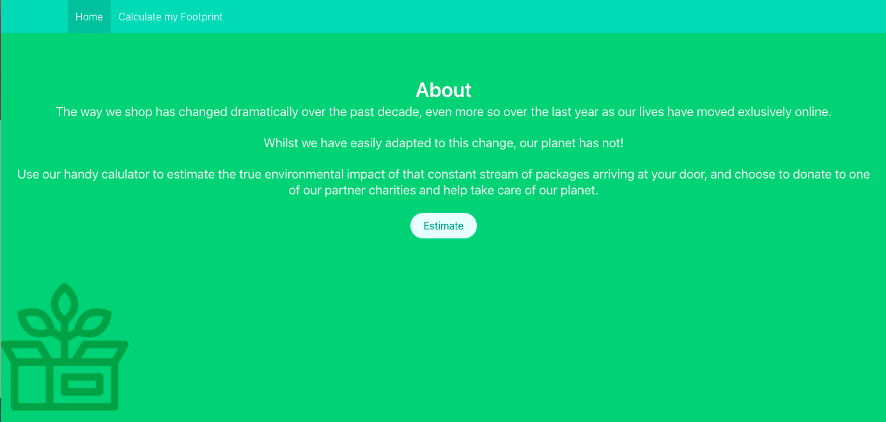
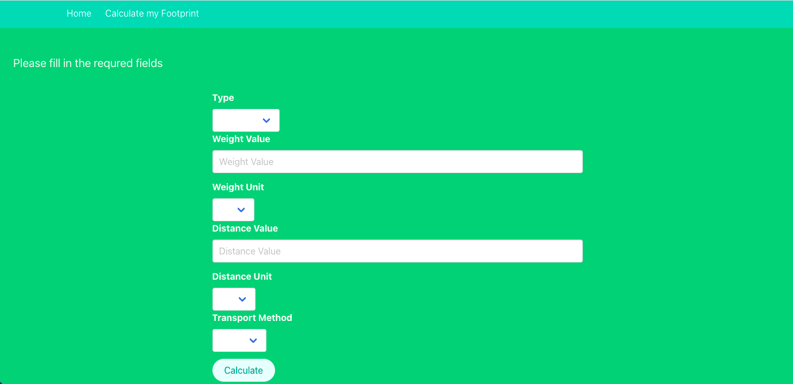
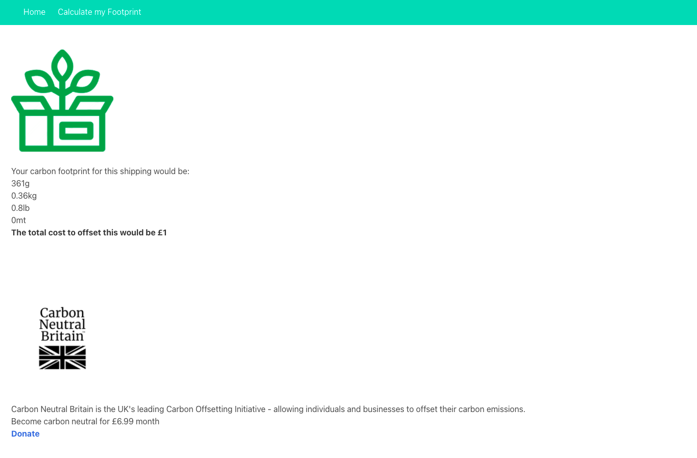

# ***CarbonFree - A Frontend React App***

A React app built during a 36-hour hackathon, using the Spoonacular API. My first pair-coding project for General Assembly's Software Engineering Immersive.

## Developed by:

- Devante Spaine - [GitHub](https://github.com/dee912)
- Drew Lamph - GitHub()


### Deployment 

I deployed this website on Netlify and it is available [here](https://carbonfree-ornellaspada.netlify.app)

### Concept

**Carbon Free** is the app that is making the e-commerce more sustainable by increasing user awarness everytime she purchases on-line. It combines shipping data (distance, vehicles) and it calculates the total carbon-dioxide emission the purchase is causing and connects to non-profit organizations that advocate a net-positive impact and a low-carbon future in the biosphere.

### Project Brief: Reactathon

- 36 hours to build a React application that consumes a public API.
- Public API could have been anything, but needed to make sense for our project.
- Have several components, including at least one classical and one functional.
- The app can have a router with several "pages", which was up to our disgression if it made sense for our project.
- Include wireframes that we designed before building the app.
- Be deployed online and accessible to the public.
- A git repository hosted on Github, with a link to our hosted project and frequent commits dating back to the very beginning of the project.
- A working request in Insomnia from the API we want to use, showing that we can access the dataset we need.

### Technologies Used 

- ***API:***
  - [Carbon Interface](https://www.carboninterface.com/)
- ***Frontend:***
  - JavaScript (ES6)
  - React.js
  - HTML5
  - SASS
  - Axios
  - react-router-dom
  - Bulma
- ***Development Tools:***
  - VS Code
  - Git + GitHub
  - VS Code Live Share
  - Netlify

## Installation Instructions

1. Clone repo code from GitHub onto your machine.
2. Use yarn or npm to install all dependencies from the package.json file.

## Wireframes 




## General Approach and Planning
We first had to choose an API we wanted to use. My partner and I realised we both have a passion for fine food and love to try new recipes, so we decided to use the very popular Carbon Estimate API.

#### API of our choice



***
### DAY 1

- We began by chatting through a very basic user story and wireframe of our apps design and components, given the limited time we had.
- We wrote throwaway code to explain our thought process to each other and to solve short term problems.
- We first took the time to read the docs for Bulma and the Spoonacular API we were using.
- We decided to pair code most of the app on VS Code Live Share so we could pool our knowledge and get more built quickly in the short time we had.
- We began by writing pseudocode before writing actual code to help us think through the logic first.
- We weren't too concerned with writing DRY code at the time, as we wanted to achieve a lot of functionality in 36 hours. We decided we would come back to re-factor repetitive code later on.
- We discussed and agreed on consistent code styles, indentation, and naming conventions.
- We made sure to commit early and often in case we broke something and needed to roll back to a previous version.
- We kept our user stories small and well-defined, trying to always come back to what our target user would actually want and need.
- We saved time by scaffolding a basic React app from a template.
- Next, we used react-router-dom to set up our App.js as the router for the site.
```
import { BrowserRouter as Router, Route, Switch } from 'react-router-dom'

```
```
function App() {
  return (
    <Router>

      <Nav />

      <Switch>
        <Route exact path="/" component={Home}/>
        <Route path="/form" component={Form}/>
        <Route path="/estimates/:id" component={Results}/>
      </Switch>
    </Router>
  )
}
```
- We wrote this function to get the data from the API for our app.
```
import axios from 'axios'

const baseUrl = 'https://www.carboninterface.com/api/v1'
const apiKey = 'PoRJbKaz5sWFZKcKRNaw'

function headers() {
  return {
    headers: { Authorization: `Bearer ${apiKey}` },
  }
}

export function createFootprint(formData) {
  return axios.post(`${baseUrl}/estimates`,formData ,headers())
}

export function displayFootprint() {
  return axios.get(`${baseUrl}/estimates` ,headers())
}
```
- We next built the UI and layout for the estimate form using Bulma columns.



- This information about the user shipping is rendered with the following React states and change functions.

#### User shipping info stored as a default object in state
```
  const [formData, setFormData] = React.useState({
    type: '',
    weight_value: 0,
    weight_unit: '',
    distance_value: 0,
    distance_unit: '',
    transport_method: '',
  })

```
#### The post request interacts with UI form page, the data are then sent to the estimate page
```
export function createFootprint(formData) {
  return axios.post(`${baseUrl}/estimates`,formData ,headers())
}

  const handleSubmit = async (e) => {
    e.preventDefault()

    try {
      const res = await createFootprint(formData)
      history.push(`/estimates/${res.data.data.id}`)
    } catch (error) {
      setIsError(true)
    }
  }
```
- In the estimate page user inputs are then used to calculate Carbon Footprint

```
export function displayFootprint() {
  return axios.get(`${baseUrl}/estimates` ,headers())
}

function Results() {
  const [estimate, setEstimate] = React.useState(null)

  React.useEffect(() => {
    const getData = async () => {
      try {
        const res = await displayFootprint()
        setEstimate(res.data)
      } catch (error) {
        console.log(error)
      }
    }
    getData()
  }, [])
  ```
  #### This is the formula to calculate calbon dioxide emission 
  ```
  {Math.ceil(estimate[estimate.length - 1].data.attributes.carbon_g * 0.000007)}
  ```
  ### DAY 2
  - The second day we had hoped to do more styling, but ended up spending most of the time de-bugging our existing code and working on the core functionality.
 
  - We decided to include links to multiple charities that can help in offsetting our CO2 footprint with small donations.

### Final Product 
___
#### Homepage


#### Form Page


#### Estimate & Philathropic Page


### Wins
- The biggest win for me, right before the end of the hackathon, was a word issue which took us few hours to solve. We were an incredible team and were able to go throught the code line by line to figure that the usage of 'lorry' instead of 'truck' on the form page the last field was causing the bug. 

- We were proud to have build an app that has a **purpose** and exemplifies the potential of the digital realm to contribute to make a positive impact in the world which is the main reason I want to work in tech.

### Challenges overcome
- The greatest challenge we faced was manipulating the API to keep track of users preferences from the shipping form. We got there in the end, but this was something we had never done before that took up most of our time on the second day.

### Key learnings
- Learnt to use React for the first time to build an app from scratch and to set up a single-page application with multiple components.
- It was my first time pair coding on any project and I learnt a lot about collaborating, communcating, planning, and using Live Share to work on the same code in real time. This worked well enough for this short project, but I probably would not use this for a bigger project when it would be more useful to divide and conquer.
- First time doing a hackathon-style project and working under time pressure. I know for the next time to be more realistic about what can be accomplished in such a short time!

### Future Implementation
- Expand contexts to calculate carbon footprints to calculate, not just shipping
- A more personalized design and a logo for the app
- Geolocalize multiple no-profit organizations and offer different ways to reduce carbon emissions and make a positive impact such as longer shipping time.

